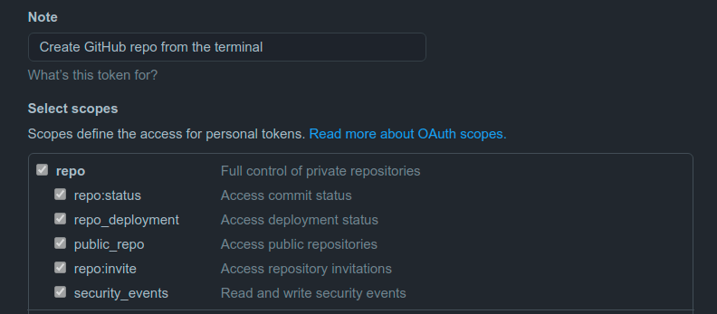
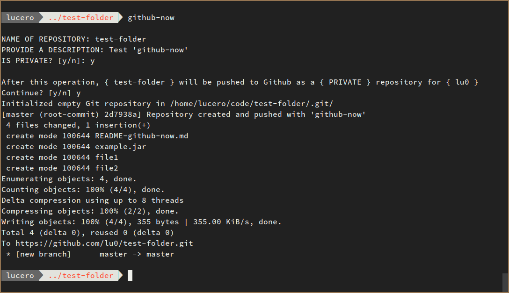

# Git scripts
Collection of scripts and utilities I create in my spare time to make my life easier when using git.

## `github-now`: Create a new Github repository
This script creates a new repository on Github from the current directory.

You'll need to [generate a token](https://github.com/settings/tokens), as password authentication is deprecated. Save your token in `~/.github-token`.




### Usage

Create a symlink of the script to your local path
```zsh
ln -sr ./github-now/github-now.sh ~/.local/bin/github-now
github-now  # run
```

`github-now` will prompt for the **description** and **privacy** of the new repository. Then all you have to do is confirm or reject the operation.



## `git-partial-clone`: Clone a subdirectory of a repository
This scripts clones a subdirectory of a github/gitlab repository.

### Usage

Fill the config file and locate it in `~/.git-partial-clone.conf`.
```zsh
# Example of the git-partial-clone configuration file

# Options: github, gitlab
GIT_REMOTE=github

# Repository name
REPO_NAME=git-scripts

# Repository owner
GIT_REPO_USER=lu0

# If the repo is private
# Path to the github-token or gitlab-token file
# Configure in: https://github.com/settings/tokens
#               https://gitlab.com/-/profile/personal_access_tokens
GIT_PWD=

# Child directory to be cloned
PARTIAL_PATH=/github-now/assets/

# Full path of the target parent directory
# leave it blank to clone in the working directory
PARENT_PATH=

# Branch
# Leave it blank to pull all branches
BRANCH=master
```

Create a symlink of the script to your local path
```zsh
ln -sr ./git-partial-clone/git-partial-clone.sh ~/.local/bin/git-partial-clone
git-partial-clone   # run
```
